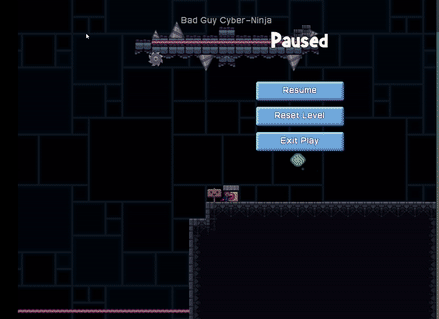
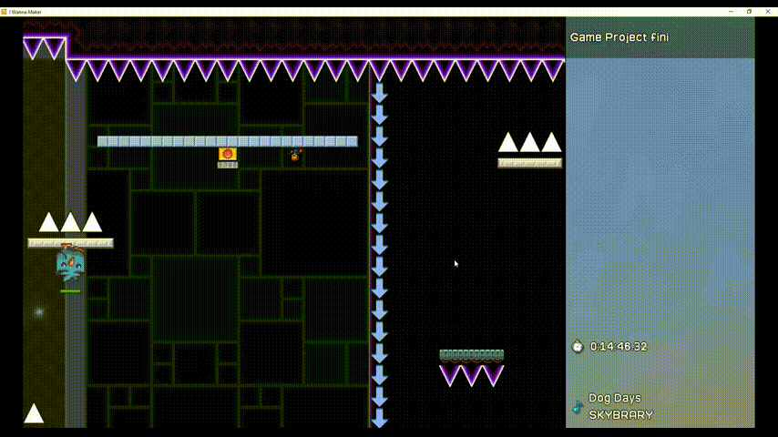
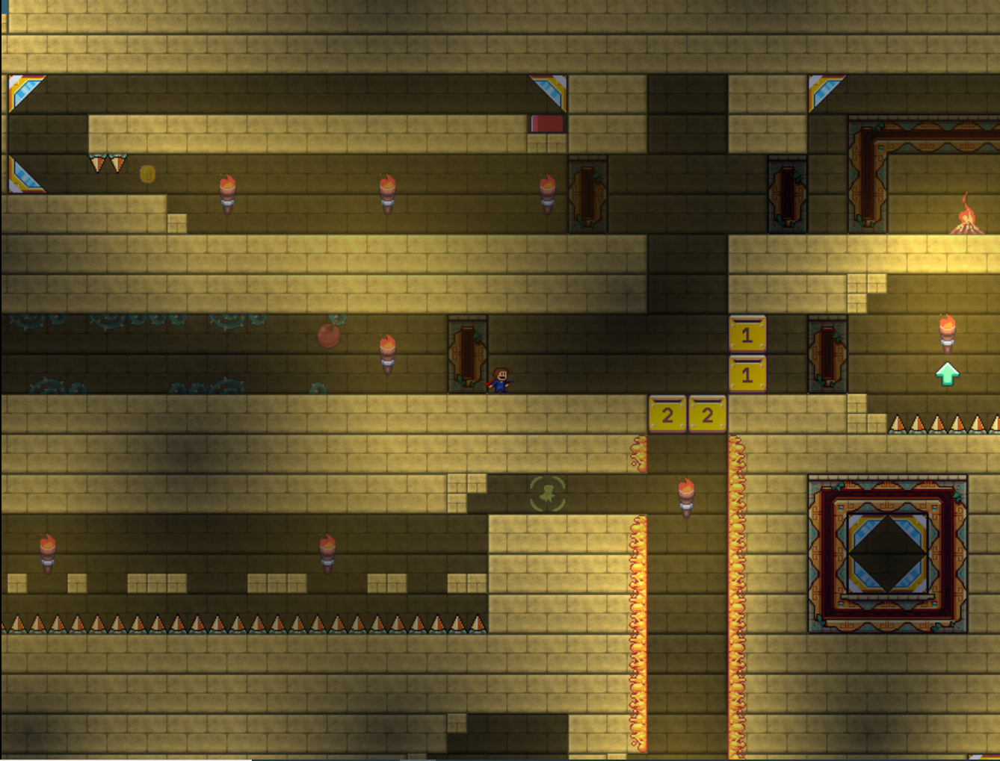
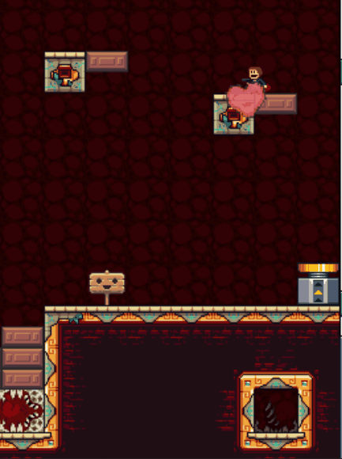
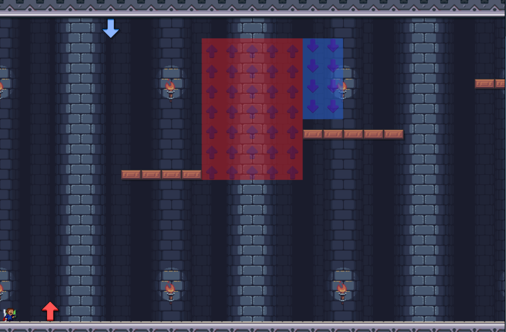
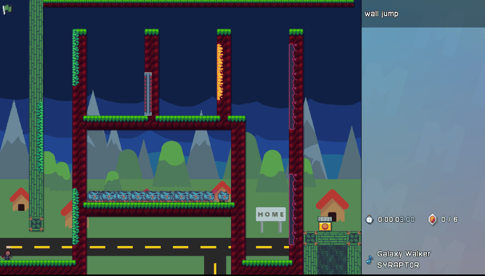
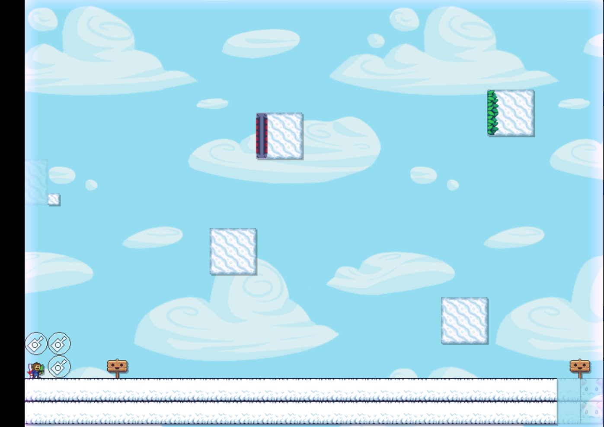

# 2024 Levels

## [Download Levels](https://github.com/Codaea/gds-levels/releases/download/2024/levels-24.zip)

## Conveyor Adventure

> "Conveyors move  
Players will jump and bounce high  
Miss the ground and fall

## Crusher Chaos

> Avoid the crushers  
It is not always easy  
some hurt some help out

## Tower Ascend

> From the base to top  
Ascend the tower quickly  
And jump on the clouds

## Pain Train

> a new mechanic,  
the amount of moving things  
falling birds aren't fun

## Super Spooky

> Level is spooky.  
Level is super spooky.  
Determination.

## Gravity Mine

> Gravity is fun  
Arrows make you fly away  
Danger is crazy

## level 1

> spinning platforms, yay  
but don't fall or hit the spikes  
for an easy win

## UltraBird

> Teleports are fuel  
The wanna makers are dead  
Birdmachine is full

## Cyber Ninja Headquarters

> I jumped over spikes  
And fought the techno ninjas.  
Was pretty cool, man.

## Gravity Chaos

> gravity changes  
and the platforms go spinning  
some say it is hard

## A Warm Spring Day 

> My level go big boing  
It has big number of springs  
Very fun you will like

## CoolLevel3.2

> Falling blocks will come,  
and fall on your little head.  
watch for danger signs!

## Amethyst Saw

> The Amythyst Twins  
In the Dark Looms Evil Teeth  
The Coin Gates Await

## Torment

> Bullets are your friend.  
you must shoot the reflectors.  
find the hidden rooms.

## Cheese

> extra jumps for you  
overran by bouncing birds  
its easy and fun

## Boo Level

> extra jumps,  proceed  
high boosting springs for you  
sad bird with no escape

## The Dunes

> "Pyramid is tall.  
You're not very tall at all.  
You find many spots.  

## The Exploding Pyramid

> Pyramid explodes  
you have to get to the top  
Some make it, some not

## Desert

> Beware. or else.  
this temple. will be come.  
refrida rador.

## Scurry Spikes

> Watch out for the spikes  
They will follow where you go  
 Scurry to safety

## Up, Down

> Gravity is good.  
Gravity is bad. Sometimes  
it is both. Good luck.

## WALL JUMP

> wall jumping is key.  
watch out for the spikes and saws.  
keep on wall jumping.

## Ready for a level?

> my level is fun :\).
you may suffer, you may not.  
you decide that though.
